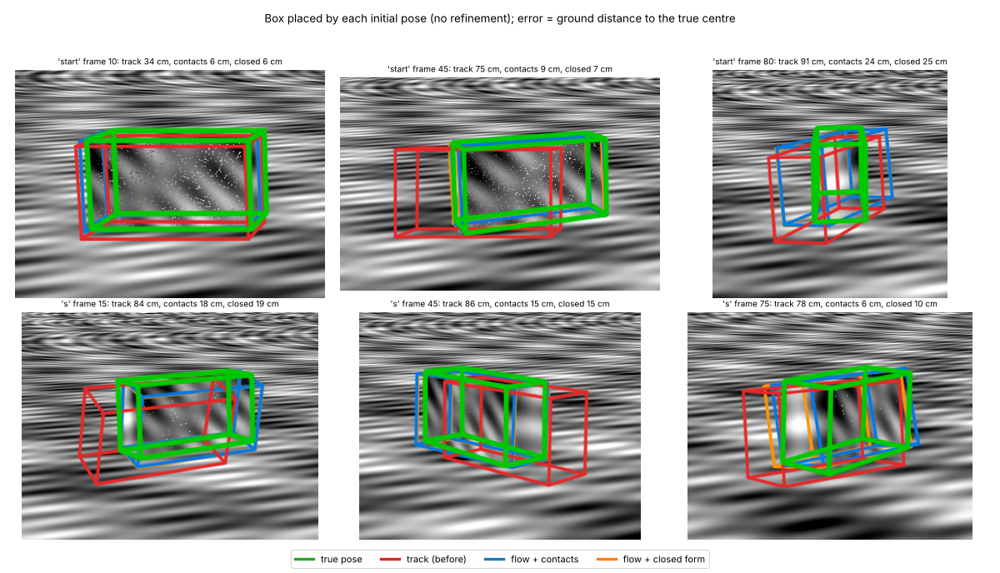
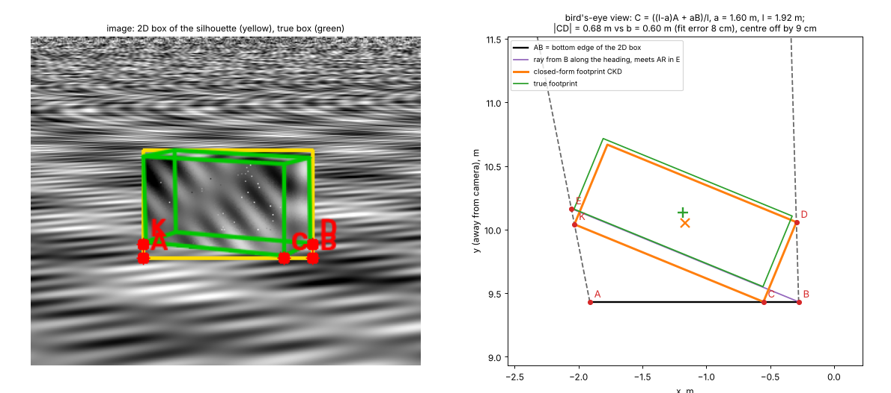
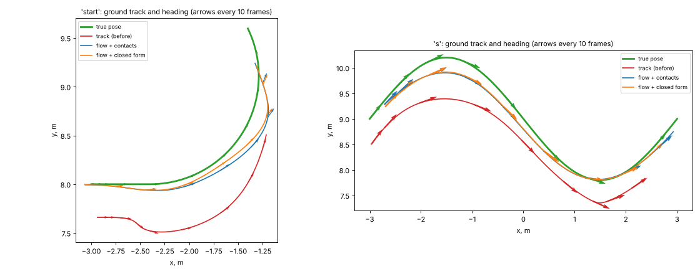

# NOTES: repo analysis, decisions, changes and verification

## 1. Repo analysis (before changes)

**Stack.** Python 3 research code: OpenCV, numpy/scipy, scikit-image/learn,
shapely and matplotlib. There was no `pyproject.toml`, no `requirements.txt`,
no build system and no tests. There are no `src/`, `lib/`, `app/`, `shaders/`
or `assets/` directories.

**Purpose.** This is monocular 3D scene segmentation: superpixel/graph
segmentation of a frame, then ground-plane calibration and inverse perspective
mapping (BEV), vanishing points, and lifting each segment to a **cuboid** given
as a bottom quad, a height and a colour (`lifting.py`, `cube.py`,
`img_rec_ipm.py`, `segment_rec.py`, `surf.py`, …).

**What "3D" existed.** Nothing was GPU-rendered. `opengl_drawer.py` uses
**matplotlib** `Poly3DCollection` / `plot_surface`, despite its name, and
contains no OpenGL. There was no real-time camera, lighting, depth buffer or
render loop.

**What was broken or weak:**

- **Dependencies.** There was no dependency list. `shape.py` and `ransac.py`
  failed to import until scikit-learn was installed. Several scripts need
  `cv2.ximgproc`, which comes from opencv-*contrib*.
- **Byte-compile.** Every `.py` file byte-compiles (`py_compile`). There are no
  syntax errors.
- **Hard-coded data and GUI scripts.** Most scripts are top-level programs with
  absolute data paths (e.g. `/home/dzhura/ComputerVision/data/...`).
  `normals.py` runs its whole pipeline at import time and crashes without that
  file. `main.py` needs a video plus an interactive `cv2.imshow` ROI click. Its
  segmentation is a placeholder: `labels = np.zeros_like(...)` and fixed
  `box_corners`.
- **TODOs.** `# TODO left, right ?` and `# TODO check orientation` in
  `cube.py` and the copies of that code in `img_*`.
- **Duplication.** Many near-duplicate 2–3k-line variants exist (`*_bk`,
  `*_cop`, `*_v2`, `*_extrem`, `surf/` copies of `cube.py`, `lifting.py`,
  `graph.py`, `main.py.bk*`).
- **Tracked junk.** `__pycache__/` was tracked in git.

**Missing for "real 3D".** A GPU renderer with perspective projection, a
camera with controls, depth testing, lighting, shadows, materials and
textures, anti-aliasing, and a timed render loop.

## 2. Decisions

- **Stay on Python, add a small OpenGL layer rather than rewrite.** The
  research code is the asset; the viewer *consumes* its output (cuboids) via
  `opengl_drawer.export_cuboids_json` / `show_cuboids_3d`. Nothing in the
  existing pipeline was rewritten.
- **moderngl + glfw.** moderngl is a thin, modern OpenGL 3.3+ wrapper (VAOs,
  FBOs, MSAA renderbuffers, depth textures) and can also create a headless EGL
  context, which made automated verification possible. glfw provides the
  window and input. Pillow loads textures and saves screenshots. Each is one
  small wheel with no heavy framework. I rejected PyOpenGL immediate mode (the
  legacy fixed pipeline) and pygame/three.js-style rewrites.
- **Own math and scene-graph module (`viewer3d/math3d.py`, `scene.py`)**
  instead of pyrr/glm. It is ~250 lines, unit-tested, and has no extra
  dependency.
- **Coordinates.** The pipeline is Z-up in BEV/pixel units. The viewer is
  Y-up. The conversion `(x, y, z) -> (x, z, -y)` is a rotation, not a mirror,
  so handedness is kept. A `world` node recentres and scales the data to about
  10 units, so lighting, shadows and camera are independent of input scale.
- **Demo data.** No saved pipeline output exists in the repo, and the scripts
  need private datasets. When no `--scene` is given, the viewer generates a
  deterministic procedural cuboid field (one cuboid per "superpixel"). The
  ground texture is the repo's `Background.bmp`.
- **Interpolated top surface.** This is the GPU equivalent of
  `draw_interpolated_surface`. It is drawn as a **wireframe** so it doesn't
  hide the cuboids. Pass `--no-surface` to hide it.
- **Research scripts left as is.** I did not delete or merge the duplicated
  scripts or remove hard-coded paths. They are the author's experiments, and
  deleting them is not reversible from their point of view. This file
  documents them instead.

## 3. Changes, one commit each

1. **`requirements.txt`.** All imports actually used, plus the viewer deps.
   Stopped tracking `__pycache__` (already in `.gitignore`).
2. **`viewer3d/math3d.py`, `scene.py`, `geometry.py`.** Matrices, a quaternion
   class, a scene graph with hierarchical transforms, a perspective camera and
   orbit controls (rotate/zoom/pan with clamping, auto-adjusted near/far).
   Geometry:
   - box, sphere, torus, plane
   - `cuboid_from_bottom`, which orients faces outward whatever the input
     winding
   - `heightfield`, using scipy `griddata` with smooth normals
   - a minimal OBJ loader
   - normals and UVs on every mesh
3. **`viewer3d/renderer.py`.** GLSL 330 Blinn-Phong with:
   - a directional sun plus hemisphere ambient light
   - shadow mapping: a 2048² depth texture, hardware compare, 3×3 PCF and
     slope-scaled bias
   - sRGB-correct colours and textures, with mipmaps and anisotropic filtering
   - 4× MSAA renderbuffers resolved into the target
   - depth test, back-face culling, double-sided and wireframe materials
4. **`viewer3d/app.py`, `scenes.py`, `__main__.py`.**
   - The `Viewer` has separate `update(dt)` and `render(fbo)` steps.
   - The glfw loop clamps dt and uses the framebuffer-size callback, so the
     framebuffer is sized in physical pixels (correct on HiDPI) while mouse
     deltas are normalised by window height.
   - Idle auto-orbit, hotkeys, an FPS/triangle count in the title, and
     screenshots rendered to an offscreen FBO.
   - Headless EGL mode.
   - Falls back to `libGL.so.1` when the unversioned `libGL.so` is missing.
5. **`tests/`.** 17 pytest tests:
   - matrix and quaternion maths, hierarchy composition and orbit clamping
   - outward CCW winding and unit normals for every closed primitive
   - heightfield and OBJ loading
   - GPU tests: the depth test is independent of draw order, there is no black
     screen, the camera reacts to orbit input, and a box's shadow darkens the
     ground on the correct side
   - JSON export round-trip from `opengl_drawer`
6. **`opengl_drawer.py`.** Added `export_cuboids_json()` and
   `show_cuboids_3d()`, which take the same arguments as
   `draw_cubes_with_bounding_image`.
7. **Docs.** `README.md` (viewer section), `RUN.md` and this file.

Dependencies added: `moderngl` (OpenGL 3.3 wrapper with headless EGL),
`glfw` (window/input), `Pillow` (textures/screenshots). Everything else in
`requirements.txt` was already imported by the existing code.

## 4. Verification

The environment was a Linux container with no GPU: Mesa llvmpipe, OpenGL 4.5,
4× MSAA available.

- `python -m pytest tests`: **17 passed**. `pyflakes viewer3d tests`: clean.
- `python -m viewer3d --headless --out docs/viewer.png`: 62 meshes and about
  7.5k triangles per frame (the count depends on the camera angle used).
- **What the image shows.** The textured ground plane (`Background.bmp`) is
  in correct perspective. About 60 coloured cuboids are lit from the upper
  left, and each has three visibly different face shades. Cuboids cast shadows
  onto the ground and onto each other. Edges are anti-aliased, with no
  z-fighting or shadow acne on the ground. The wireframe surface floats above
  the cuboid tops. The white sphere shows a specular highlight, and the
  tilted orange torus and blue cube orbit with it.
- **Shadow check without texture.** With the texture disabled (`--texture ""`),
  every box has a clearly offset shadow on the grey ground.
- **Real window under Xvfb.** `xvfb-run python -m viewer3d --max-seconds 6
  --screenshot-on-exit` opened a GLFW OpenGL 3.3 core window and rendered the
  same scene. The animation advanced between frames.
- **Real mouse input with xdotool.** I sent a left-drag, 4 wheel clicks and a
  right-drag to the Xvfb window. The camera orbited, zoomed in and panned. The
  mean absolute pixel difference against a run with no input was 36/255.
- **Not verifiable here.** I could not test a physical HiDPI monitor. The code
  uses `glfw.get_framebuffer_size` for rendering and window-size coordinates
  for input, which is the standard DPR-correct setup.
- **Bug found and fixed during verification.** Reading the window back buffer
  after `swap_buffers` returned garbage. Screenshots now render into their own
  FBO.

## 5. Real 2D → 3D lifting on the repo photos

`reference.JPG` (empty scene) and `box.JPG` / `pig.JPG` (3036×1760) match the
vanishing-point lines hard-coded in `surf.py`, so they are the intended input.
`lift_to_viewer.py` runs `surf.py`'s `process_images` headlessly on them and exports the
cuboids for the viewer (`docs/real_lifting.png`, `docs/box_cuboids.json`, `docs/pig_cuboids.json`).

- **`img_rec_ipm.py` is out of date.** It calls `graph.find_neighbors(labels)`,
  but `find_neighbors` now also needs the contour mask, as `surf.py` passes it.
  `surf.py` is the current pipeline.
- **Fixed: `graph.find_neighbors` never finished on full-size photos.** It
  looped over every contour pixel for every label pair. It is now vectorised,
  and `tests/test_graph.py` checks the results are identical.
- **Speed-up, in the script only.** `lift_to_viewer.py` memoises
  `get_projected_box` because the recursive growth recomputes the same masks.
  This takes `box.JPG` from >30 min to ~100 s and `pig.JPG` to ~30 s, with the
  same output.
- **Result: the lifting is only partial.** The object is segmented correctly,
  but out of ~115 superpixels only **6 (box)** and **8 (pig)** cuboids come out.
  About 350 "Error computing" messages show the 3D face is `None` for most
  segments. The resulting cuboids are small blocks, all in one colour, and do
  not form a recognisable box or pig shape. The lifting maths (`lifting.py`,
  `cube.py`, `process_segment` in `surf.py`) is where the work is needed;
  the viewer shows what the pipeline produces faithfully.

## 6. Refined lifting (`lift3d.py`), verified in 3D

**Why the original output did not match the objects.** `surf.py`/`cube.py`
fit a box to the silhouette in 2D only, then map it through a homography onto
*hard-coded* object dimensions. The flag `pig = True` gives 21×7×7 and is
used for the box photo too. The cuboid coordinates therefore have no metric
relation to the object.

**Method.** All in `lift3d.py`; the module docstring has details.

1. **Calibrated camera from the three vanishing points.** The VP triangle's
   orthocentre is at (1487, 844) and f = 4471 px; all three pairwise focal
   estimates agree. The camera reproduces each VP exactly and looks down at
   38°. The world frame has Z up and ground Z = 0. Units are camera heights,
   so the model is metric up to one scale factor.
2. **Mask.** Same background subtraction as `surf.py`, keeping the largest
   component.
3. **Bounding box.** A yawed 3D box on the ground, fitted so its projection
   matches the silhouette.
4. **Shape model**, chosen automatically by how well a single box explains the
   silhouette (box-fit IoU ≥ 0.975):
   - **box**: one solid cuboid. It is refined so that its visible 3D edges,
     including interior ones the silhouette can't see (the near vertical edge
     and the top-front edges), lie on image edges. This is a coarse-to-fine
     truncated chamfer.
   - **round**: a generalised cylinder along the box's long axis. In each
     slice the visual hull is a wedge between the ground and the near and far
     lines of sight. The round cross-section resting on the ground and
     touching that wedge is unique: the wedge's incircle. Each cuboid spans its
     disc (its bottom z is above 0 where the disc curves underneath). Radii are
     median-smoothed, and slivers at the ends are dropped.
   - **free**: carved columns with a reflection-symmetry prior (the earlier
     approach; still available with `--shape free`).
5. **Colours** come from the photo pixels on the object.

**3D verification, not just the projection.** A silhouette says nothing about
how deep an object goes, so reprojection IoU alone can't show 3D correctness.
I checked the 3D shape in two independent ways:

- **Real box against hand-traced 3D edges.** The six VP lines in `surf.py` are
  traced box edges. Their intersections give six visible 3D corners, which
  are independent of the mask. The traced top and bottom edges disagree by a
  few percent (dented corner, bulging lid, manual tracing), and that
  disagreement is reported as the uncertainty:

  | | L | W | H |
  |---|---|---|---|
  | Ground truth (traced) | 0.348 ± 0.025 | 0.446 ± 0.012 | 0.282 ± 0.017 |
  | Lifted model | 0.362 | 0.447 | 0.279 |

  - Corner error is 2.4% of the box diagonal.
  - **Volume IoU is 0.89.** The carved-column model without these priors
    scored 0.65, and the original pipeline's dimensions were 21×7×7.

- **Synthetic objects with known 3D shape** (`synthetic3d.py`). Each shape is
  rendered through the same camera at the pig's position, lifted, and scored
  by Monte-Carlo volume IoU:

  | Shape | Model | Volume IoU | Silhouette IoU |
  |---|---|---|---|
  | Box 0.30×0.20×0.15, yaw 20° | box | **0.93** | 0.98 |
  | Lying cylinder r = 0.06 | round | **0.85** | 0.94 |
  | Pig (ellipsoid body, head, snout, ear, legs) | round | **0.66** | 0.91 |

  Before the round model, the cylinder scored 0.38 and the pig 0.38–0.47, with
  similar silhouette IoUs. That is the evidence that a matching projection
  does not mean a matching shape.

- **Real pig.** Reprojection IoU is 0.89 (precision 0.92, recall 0.97). The
  model is a rounded body of the right length with a raised head end
  (`docs/lift3d_results.png`). There is no 3D ground truth for the toy, so its
  3D accuracy is bounded by the synthetic pig result.

**Limits (single view).**

- **Cross-section aspect is unobservable.** Width vs height of a rounded cross
  section can't be determined from one silhouette. On the synthetic pig, the
  true aspect (1.44) and the round default (1.0) both give silhouette IoU
  0.925, while their volume IoU is 0.72 vs 0.66. `--aspect` sets this prior;
  the default is 1 (round).
- **Thin protrusions are not reconstructed.** Parts thinner than a slice, such
  as the pig's ear, are missed. A "fin" heuristic added spikes in the wrong
  places, so I removed it.
- **The hidden back side** is a prior (box or round), never observed.

**Tests.** `tests/test_lift3d.py` checks that:
- the camera reproduces the VPs;
- the box photo's dimensions fall within the traced uncertainty, with volume
  IoU > 0.85;
- the synthetic volume IoUs stay above 0.9 (box), 0.8 (cylinder) and
  0.6 (pig).

## 7. 3D from video (`video3d.py`, `video_demos.py`)

Silhouettes from a single photo leave the depth of the object to assumption.
Video gives many views of the same object.

### Rigid object, fixed camera (bike.mp4)

1. **Background.** Per-pixel median over the video; this is `surf.py`'s
   `reference.JPG`, computed instead of photographed.
2. **Masks.** Median difference. Thin see-through gaps are kept (spokes,
   frame). The cast shadow is stripped: in the lowest band of the silhouette
   only long vertical runs survive.
3. **Camera.**
   - Forward vanishing point of the painted parking lines, by LSD + RANSAC.
     It is found automatically, 3 px from a hand-picked value.
   - Metric scale from the 2.74 m stall width.
   - Focal length chosen so the stalls are 5.49 m deep (standard 9 × 18 ft).
     The silhouette fit alone hardly constrains it.
4. **Poses.**
   - Ground track from the silhouette's contact point.
   - Heading from the direction of travel.
   - Lean from the turn radius.
   - Each frame's (x, y, heading, lean) is then refined against its
     silhouette, first by IoU and then by truncated chamfer distance,
     alternating with carving.
5. **Shape.** A voxel grid in the bike's own frame. A voxel is kept if it
   projects inside the silhouette in ≥ 93 % of the training frames, which
   tolerates mask errors and the moving rider. Output is a marching-cubes mesh
   with per-vertex colour (median over the frames that see the vertex unoccluded).
6. **Verification.** Even frames carve; odd frames are held out.

| Frames used for carving | 1 | 2 | 4 | 8 | 16 | 32 | 64 | 128 | 589 |
|---|---|---|---|---|---|---|---|---|---|
| Held-out silhouette IoU | 0.41 | 0.57 | 0.65 | 0.77 | 0.79 | 0.80 | 0.81 | 0.81 | 0.81 |

- One frame (what a single photo gives) explains other views poorly.
  Eight frames already reach 0.77.
- Model size with rider: 2.04 × 0.72 × 1.50 m. This is plausible for a large
  naked bike plus rider.
- **Limit:** the camera is only ~1.3 m high and never sees the top, so the
  shape is a visual hull. It is blobby where no silhouette carves (between
  the rider's legs and the tank, under the seat).

### Non-rigid subjects (horse, person)

A trotting horse or a kicking person changes shape between frames, so
carving across frames is not valid. Instead:

- **Inflation.** The cleanest side-view silhouette is inflated: every part is
  a tube whose half-depth at distance D from the outline is
  `thickness * sqrt(D (2R - D))`, with R the local inscribed-disc radius.
- **Thickness from other views.** Thickness is fitted on the frames where the
  subject turns, using a weak-perspective view fit of the model to each mask.
  Only the upper body is compared, so moving legs do not decide it.
  Thicknesses within 0.005 of the best score count as ties, broken towards
  round.
- **Check.** On held-out turning frames the result is compared with a flat
  cut-out.

### Per video

| Video | Method | Result |
|---|---|---|
| bike.mp4 | multi-view carving (above) | held-out IoU 0.81, metric |
| Horse.mp4 | inflation, thickness fitted | see metrics; width barely observable (horse seldom turns to camera); scale assumes back height 1.55 m |
| Yeop.mp4 | inflation, thickness fitted | see metrics; scale assumes body height 1.65 m |
| Air.mp4 | single frame, round assumed | outline traced by hand + GrabCut: hazy sky has the paint's colour, crowd hides the gear |
| Monument.mp4 | single frame, round assumed | camera barely moves; the fall is not usable as views (dust, partial) |
| Bender.MP4 | single frame, round assumed | film cuts, one face |
| Por.mp4 | single frame, round assumed | one viewpoint, 320×240 |

Metrics per video: `docs/video3d/*_metrics.json`. Pictures: `*_sheet.png`,
`bike_pipeline.png`, `bike_orbit.gif`.

**Reproduce.** `python video_demos.py <name> --video <file> --out docs/video3d`.
The videos and the generated `.ply` meshes are not committed.

**Tests.** `tests/test_video3d.py` covers:
- the ground camera's VP and scale;
- carving a box that drives in a circle (volume IoU > 0.8, held-out
  IoU > 0.8), and one view failing at it;
- heading and lean signs;
- inflation of a disc giving a sphere;
- recovery of the weak-view rotation.

## 8. Novelty and prior work (assessment)

Each building block is established:
- **Calibration:** vanishing-point camera calibration and single-view metrology
  (Caprile & Torre 1990; Cipolla et al. 1999; Criminisi et al. 2000).
- **Vehicle 3D boxes from vanishing points** in fixed traffic cameras (Dubská
  et al. 2014; Sochor et al., BoxCars). This is the closest prior work to the
  original `surf.py`/`cube.py` idea.
- **Visual hull** (Laurentini 1994; Szeliski 1993).
- **Shape from silhouette across time** for a moving rigid object (Cheung,
  Baker & Kanade 2003).
- **Silhouette inflation** (Teddy 1999; Monster Mash 2020).

A possible narrow contribution, for a workshop paper or technical report:
training-free metric shape of road users from one uncalibrated fixed camera.
It would rest on:
- self-calibration from painted ground lines and standard stall sizes;
- kinematic priors for two-wheelers (lean from the turn) inside
  silhouette-across-time carving;
- robustness measures: shadow stripping, a carving consensus threshold and
  chamfer pose refinement;
- a frames-vs-accuracy study.

Missing before writing:
- ground truth (synthetic CAD scenes, or vehicles of known dimensions);
- more videos;
- baselines: VP-box, single view, carving without pose refinement, learned
  methods (DUSt3R, TripoSR);
- ablations;
- a literature search confirming the lean-prior angle.

## 9. The original recursive segment method: drift fix and Make3D comparison

`segment3d.py` keeps the structure of `surf.py`/`cube.py`:
- a vanishing-point tangent box per superpixel;
- seeds at the object's six extreme points;
- recursive propagation between neighbouring superpixels.

The geometry is replaced with the calibrated camera from `lift3d.py`.

**Findings.**
- **The original's whole-object tangent box is metric once the camera is
  calibrated.** On `box.JPG` it gives 0.320 × 0.461 × 0.304 m against the
  traced 0.348 × 0.446 × 0.282 m, with zero reprojection error.
- **Recursive boxes.** With the calibrated camera, every superpixel gets a box
  (104/104 on `box.JPG`, against 6 with the original code). But the boxes
  drift in 3D. A superpixel is a patch of surface, while its box depth comes
  from its 2D extent, and the error accumulates along the propagation.
- **Drift fix (`patch_reconstruct`).** Each superpixel is a planar patch: its
  pixels back-projected onto an axis-aligned plane, so no depth is guessed.
  - Seeds sit on faces of the main box. That box is `lift3d`'s edge-refined
    fit, which matters: anchoring on the silhouette-only box gives 2.2 %
    median error, the edge-refined box 1.3 %.
  - A neighbour goes on the same plane or folds through the shared edge.
    Colour similarity and vanishing-point edge votes pick between the two
    (the orientation-map cue of Lee, Hebert & Kanade 2009).
  - A connectivity refinement then minimises 3D gaps across boundaries.
- **Make3D-style baseline (`make3d_planes`).** A global least-squares solve of
  one free plane per superpixel, with Make3D's connectivity and coplanarity
  terms (Saxena et al. 2009). The original Make3D code and its learned depth
  model are not reachable from this environment, and the model was trained on
  outdoor scenes. Its learned per-pixel term is therefore replaced by the same
  seed anchors the recursive method uses.

**Per-pixel depth error against 3D ground truth** (`python segment3d_eval.py`):

| Method | box.JPG (traced box): median / ≤3 % | synthetic pig: median / ≤3 % |
|---|---|---|
| Recursive boxes (original method, calibrated; segments may also attach to main-box planes) | 3.6 % / 46 % | 3.0 % / 49 % |
| **Recursive planar patches (drift fix)** | **1.3 % / 84 %** | 4.0 % / 40 % |
| — without the orientation cue | 1.2 % / 86 % | 4.0 % / 40 % |
| — without connectivity refinement | 1.3 % / 82 % | 5.0 % / 29 % |
| — with the silhouette-only main box | 2.2 % / 65 % | 4.8 % / 29 % |
| Make3D-style MRF (same anchors) | 1.8 % / 68 % | 5.1 % / 31 % |
| `lift3d` (box / round model), reference | 0.5 % / 100 % | 2.0 % / 68 % |

**Reading the results.**
- **Flat-faced objects.** On `box.JPG` the drift fix cuts the original
  recursive method's error by about 3× and beats the Make3D-style global
  solve. The edge-refined main box is the largest single gain; connectivity
  refinement removes gross outliers (mean error 3.4 % → 2.6 %).
- **Orientation cue.** It does not help on this photo (printed graphics give
  misleading edges) and has no effect on the untextured pig.
- **Curved objects.** Axis-aligned flat patches suit flat faces, not curves.
  On the pig the patches are worse than the original's solid segment boxes,
  and the Make3D-style solve, with few anchors, is worst.
- **Whole-object models.** For both objects, `lift3d`'s whole-object models
  are more accurate than any per-segment method. Per-segment methods only pay
  off when parts sit at different depths, which these test objects lack.

**Possible next steps.**
- Free (not axis-aligned) patch planes for curved objects.
- Combine the round model as anchors with segment-level detail.
- Test on multi-part objects.

## 10. The original recursive box method on video (`video_segments.py`)

This reuses the bike.mp4 solution from section 7:
- the calibrated camera;
- each frame's pose (including lean);
- the carved model's extent, used as the main box.

**Per frame.** The camera is expressed in the motorcycle's frame, which gives
the vanishing points of the object axes for that frame. `segment3d.reconstruct`
then runs unchanged.
- The original 2D tangent box (`cube.compute_3d_box_from_plain_mask_new`)
  assumes the X vanishing point lies left of the Y one.
- When the bike faces the other way, the method works in a frame rotated 90°
  about the up axis, and the boxes are rotated back.
- Without this, 30 of 74 sampled frames produced no boxes. 15 frames still
  produce none: near head-on views, where a vanishing point is at infinity.

**Fusion.** All boxes are in the object frame. A voxel is kept when the boxes
of at least τ of the frames cover it; τ = 0.3 is chosen on the fusion frames.

**Held-out silhouette IoU (74 odd frames)**

| Model | held-out IoU |
|---|---|
| One frame | 0.513 |
| Fused, before the rotation fix (28 frames) | 0.723 |
| **Fused, 59 frames** | **0.765** |
| Carving | 0.848 |

Reproduce with:

    python video_segments.py --video bike.mp4 --background background.png --out docs/video3d

## 11. Improving the recursive cuboids: a global solve (`cuboids_global.py`)

**The key fact.** Once the camera is calibrated, a segment's VP-tangent 2D box fixes its
3D box up to one number. Every lift is a scaled copy of a canonical lift, scaled about
the camera centre: `box(s) = C + s (B - C)`. This is verified to 1e-9 m.

So the recursive method has one unknown per segment, and all its constraints are linear
in those unknowns:
- **contact:** the face pair chosen by 2D overlap is coplanar, as in the original;
- **depth continuity** on shared boundaries;
- **seed anchors** on the main box.

**The variant.** Instead of breadth-first propagation, solve all constraints at once:
- robust least squares (IRLS with a Huber loss);
- each scale bounded so its box stays inside the main box.

**Per-pixel depth error against 3D ground truth** (`python cuboids_global.py --eval-dir <segeval>`):

| Variant | box.JPG median / ≤3 % | synthetic pig median / ≤3 % |
|---|---|---|
| Original recursive boxes (greedy) | **3.6 % / 46 %** | 3.0 % / 49 % |
| Global: contact only | 4.5 % / 36 % | 2.7 % / 56 % |
| Global: continuity only | 4.8 % / 35 % | 2.3 % / 61 % |
| Global: contact + continuity | 4.8 % / 35 % | 2.4 % / 61 % |
| — no robust loss | 4.9 % / 34 % | 2.7 % / 54 % |
| — no main-box bounds | 4.3 % / 34 % | 9.2 % / 34 % |
| — silhouette-only main box | 5.9 % / 28 % | 3.2 % / 47 % |
| — smaller segments (100 px) | 5.3 % / 32 % | 3.4 % / 44 % |
| — plus a whole-object prior (`lift3d` model depth) | 3.8 % / 45 % | **2.2 % / 62 %** |
| Recursive planar patches (§9) | **1.3 % / 84 %** | 4.0 % / 40 % |
| `lift3d` whole-object model | 0.5 % / 100 % | 2.0 % / 68 % |

**Reading the results.**
- **Curved object (pig): the global solve helps** (3.0 % → 2.3 %). The robust loss
  and the main-box bounds are both needed.
- **Flat-faced box: it is worse** (3.6 % → 4.8 %). Each segment is a solid box whose
  depth comes from its 2D extent. Continuity and contact then pull neighbouring solids
  to the same depth, which flattens the box's faces into a wrong compromise. The
  planar patches (§9) remain the right model for flat faces.
- **No variant beats the whole-object models** on these single-part objects.
- **Choosing a variant:** planar patches for flat-faced objects, the global box solve
  for curved ones.

## 12. Triangulation, 3D normals and shape from normals

### 12a. Video: triangulation in the object frame (`video_normals.py`, bike.mp4)

**Setup.** In the motorcycle's frame, the fixed camera becomes a moving camera, with
the poses known from §7. So feature tracks can be triangulated in metres with no
further unknowns.

**Tracks.** KLT tracks inside the mask, with a forward-backward check. Even and odd
frames are tracked separately; odd frames are held out.
- Even frames: 1777 tracks; 634 triangulated (baseline ≥ 3°, reprojection ≤ 2.5 px);
  457 lie near the carved hull.
- Median reprojection error: **1.34 px**, so the §7 poses are good enough for
  triangulation.

**Normals.** A local plane fit (PCA, 16 neighbours), oriented towards the cameras
that saw each point.

**Models**, scored on points triangulated only from the held-out odd frames
(distance to the surface) and on held-out silhouette IoU:

| Model | held-out points: median distance / ≤5 cm | held-out IoU |
|---|---|---|
| Carving (silhouettes only, §7) | 2.7 cm / 76 % | **0.848** |
| Poisson from triangulated points + PCA normals | 3.1 cm / 70 % | 0.747 |
| Poisson from triangulated + carved-surface oriented points | 2.9 cm / 79 % | 0.694 |
| **Carving + free space from triangulated points** | **2.3 cm / 85 %** | 0.845 |

- **Free-space carving.** If a camera saw a point, the voxels between the camera and
  that point are empty. This removes 8421 voxels that silhouettes cannot remove
  (concavities) and moves the model closer to independently measured surface points.
- **Poisson from these sparse points alone** is worse. 457 points are too few for a
  surface, and the textureless parts (tyres, black engine) have no tracks.

### 12b. Single image: shape from normals (`normal_integration.py`, synthetic pig)

**Integration.** A normal field fixes the gradient of log depth:

    d log z / du = -n_x / (n · (u - cx, v - cy, f))

Poisson-type least squares then gives the shape up to scale. The lowest object pixels
on the table fix the scale, so no ground truth is used.

| Normals | depth error median / ≤3 % |
|---|---|
| Exact normals of the true surface | 3.9 % / 40 % |
| Exact + 5° noise | 3.8 % / 41 % |
| Exact + 10° noise | 3.9 % / 41 % |
| Silhouette normals (image only: exact on the outline, harmonic inside) | 8.2 % / 38 % |
| Exact normals, plain least squares | 3.9 % / 40 % |
| **Exact or 10°-noisy normals, true discontinuities, each part placed at its true depth (oracle)** | **0.5 % / 93–99 %** |

**Reading the results.**
- **Shape from normals is accurate and robust to noise (0.5 %),** but only within
  each smooth part. Normals carry no information across a depth discontinuity, here
  where the head occludes the body.
- **So two things are missing:**
  - finding the discontinuities: robust (IRLS) integration and cutting at grazing
    normals did not find them reliably;
  - placing the separated parts relative to each other.
- **Integrating within superpixels**, then solving one depth offset per segment
  (as in §11), also did not beat 2–3 %.
- **Silhouette normals alone are too crude** (8 %): they only reproduce an inflated
  round shape.

**Where normals pay off.** Combined with something that places the parts:
- in video: triangulated points or carving (12a);
- in one image: the cuboid seeds and contacts. Each segment would get a shape from
  normals, and the global solve (§11) would place the segments.

A learned single-image normal estimator (DSINE, Omnidata) would provide the normals;
the 10°-noise rows show that errors of that size do no harm. It needs downloading
model weights, which were not used here.

## 13. Combining the recursive cuboids with triangulation (`video_cuboids.py`)

**The anchor.** A triangulated 3D point that falls inside a segment fixes that
segment's one unknown scale directly: its box front must lie at the point's measured
depth. So each point becomes one more linear row in the global solve of §11.

This works in both directions:
- triangulation gives exact depth only where there is texture;
- the cuboid constraints (contact, continuity, seeds) carry that depth to the
  segments without points.

**On bike.mp4.** Each sampled even frame is solved three ways on the same
superpixels; each method's boxes are fused by voxel voting, as in §10. The fused
model of the third method is then cut by free space (§12a). Points come only from
even-frame tracks, about 40 per frame.

| Fused model | held-out IoU | held-out points: median / ≤5 cm |
|---|---|---|
| Recursive cuboids, greedy (original) | 0.753 | 5.9 cm / 43 % |
| Recursive cuboids, global solve | 0.782 | 5.8 cm / 45 % |
| **Recursive cuboids, global + triangulated points** | **0.815** | 4.7 cm / 53 % |
| **… + free space** | 0.813 | **3.1 cm / 69 %** |
| Carving (reference) | 0.848 | 2.7 cm / 76 % |
| Carving + free space (reference) | 0.845 | 2.3 cm / 85 % |

Each step helps the cuboid model:
- the global solve: +0.03 IoU;
- the points: another +0.03 IoU and 1.1 cm closer;
- free space: another 1.6 cm closer.

Carving is still best on this video, because it uses every frame's full outline. The
cuboid route is the one that also applies to a single photo.

**The same anchors on a photo.** On `box.JPG`, true depths with 0.5 % noise stand in
for triangulated points. The global solve's median error is 4.8 % with no points,
then 4.1 % with 10 points, 3.1 % with 30 and **1.9 % with 100**.

Images: `docs/segments/cuboids_global_box.png`, `cuboids_global_pig.png` and
`bike_cuboids_points.png` (`docs/make_cuboids_demo.py`).

## 14. Initial poses from optical flow (SpringerLifting chapter, step 1)

Idea taken from `SpringerLifting/author/moving.tex`: the heading of a moving object is
the direction of its dense optical flow, and with the heading known the footprint
rectangle on the bird's-eye view follows from the silhouette's ground contacts.
`video3d.flow_headings` back-projects every object pixel and its Farneback flow end
point onto the ground (a homothety from the camera, so a translation keeps its direction
at any point height) and takes the magnitude-weighted mean direction.
`video3d.footprint_centre` puts the pose at the footprint centre instead of the
silhouette's nearest point. `initial_poses(..., frames=...)` uses both; `run_bike` passes
the frames.

`bench_flow_init.py` renders a textured 1.6 x 0.6 x 0.9 m box on textured ground
(camera of `tests/test_video3d.py`), carves it from the initial poses alone (no pose
refinement) and checks held-out silhouettes (`docs/video3d/flow_init_benchmark.*`):

| trajectory | heading err median (track -> flow) | position err median | held-out IoU | volume IoU |
|---|---|---|---|---|
| arc | 6.5 -> 2.6 deg | 0.82 -> 0.21 m | 0.83 -> 0.91 | 0.43 -> 0.59 |
| start (from rest, then tight turn) | 23.2 -> 4.5 deg | 0.74 -> 0.09 m | 0.78 -> 0.86 | 0.48 -> 0.53 |
| s-curve with speed dip | 5.7 -> 4.7 deg | 0.81 -> 0.13 m | 0.71 -> 0.86 | 0.36 -> 0.59 |

Limits: in a tight turn (radius ~1 m for a 1.6 m box) the rotation adds flow and the
heading error grows to 25-30 deg ("start", last frames); a static object gives no flow
(falls back to interpolation between moving frames). Not yet measured on bike.mp4,
which is not in the repository: `python video_demos.py bike --video bike.mp4` now uses it.

### Closed-form footprint (article's formula)

`video3d.footprint_closed_form` implements the construction from the chapter's section
"Lifting 2D Object Detection to 3D": the silhouette's 2D box becomes the ground segment
AB with side rays AR and BT; a ray from B along the heading meets AR in E (l = |EB|),
C = ((l - a) A + a B) / l on AB, K = A + (a/l)(E - A) on AR, D on BT perpendicular to KC
through C; |CD| against the expected side b is the fitting error. Both assignments
(KC = length or width) and both heading signs are tried. As in the article, a fit is
accepted only below a small error (`max_fit_err` = 20 % of b), otherwise the ground-contact
footprint is used. Option `initial_poses(..., footprint="closed", dims=(L, W))`; without
dims the median size from the contacts is used.

Footprint centre error with the exact heading (median, m):

| trajectory | closed form | ground contacts | closed form fits |
|---|---|---|---|
| arc | 0.087 | 0.107 | 93 % |
| start | 0.041 | 0.077 | 52 % |
| s-curve | 0.058 | 0.080 | 93 % |

With the optical-flow heading (2.6-4.7 deg median error) the advantage is gone: position
error 0.19 / 0.07 / 0.17 m vs 0.21 / 0.09 / 0.13 m, held-out IoU 0.903 / 0.863 / 0.846 vs
0.905 / 0.864 / 0.863. The construction rotates the rectangle about the touch points, so
a heading error moves the centre more than it moves the contact extents; it also
degenerates near side-on views (l close to a) and assumes the box's left/right image
extremes are bottom corners. The default therefore stays `footprint="contacts"`. Knowing
the true size does not change this (`flow_closed_true_dims`). The closed form becomes
useful once the heading is refined (after pose refinement, or with tracking) or for
the type-size step, where its fitting error ranks object types.

Demo pictures (`python docs/flow_init_demo.py`):

### On bike.mp4 (data/bike.mp4)

`python docs/bike_flow_demo.py --solution out/bike/bike_solution.npz` (pictures
`docs/video3d/bike_flow_*.png`, numbers `bike_flow_init.json`). Reference = the poses after
the full pipeline's refinement.

| initial poses | heading vs refined (median / p90) | bike carved from initial poses only, held-out IoU | full pipeline, held-out IoU |
|---|---|---|---|
| track (before) | 9.4 / 32.6 deg | 0.405 | 0.8126 |
| flow heading, bottom-centre position (default now) | 11.0 / 24.6 deg | 0.404 | 0.8130 |
| flow heading + contact footprint | same | 0.309 | - |
| flow heading + closed-form footprint | same | 0.309 | - |

- The flow heading is as good as the track heading here (the bike always moves, at a
  steady speed, so the track has no weakness to fix); fewer large errors (p90 25 vs 33 deg),
  slightly larger median. End to end the pipeline's pose refinement makes the two
  starts equivalent (0.8130 vs 0.8126).
- The footprint position fails on the bike: when it faces the camera, many silhouette
  columns end at the handlebars or the rider, not on the ground, so "ground contacts"
  are placed metres behind it (frames 686, 1082 in `bike_flow_frames.png`). That is the
  article's assumption that the object fills its 2D box like a cuboid; a motorcycle
  does not. Hence `footprint="bottom"` is the default; "contacts" and "closed" are
  options for box-like objects (vehicles), where the synthetic benchmark shows the gain.
- On the rendered boxes, the gain listed above comes from the footprint position; the
  flow heading alone with the bottom-centre position is no better than the track
  (`flow_bottom` in `flow_init_benchmark.json`).
- Two fixes found on real data: flow headings are smoothed as unit vectors (unwrapping
  noisy per-frame angles produced +-360 deg jumps), and pixels less than ~3 deg below
  the horizon are left out with the ground-displacement weight capped (the rider's
  shoulders are at camera height, 1.32 m, where back-projection blows up flow noise).
- Horse.mp4 is not in data/; the method would need the panning camera's motion removed
  first (the article assumes a fixed camera).

## 15. 3D part segmentation from motion (parts3d.py)

Goal: split the object carved by `video3d.py` into parts that move rigidly relative to
each other (wheels, steering, rider), from the same single fixed-camera video, without
training. The 3D counterpart of the SpringerLifting chapter's flow clustering: there 2D
flow is clustered into objects in the image; here flow residuals against the carved 3D
model are explained by a set of rigid part motions, and every label sits on a voxel.

Method (`parts3d.segment_parts`):
1. Visible surface voxels per frame pair (coarse z-buffer); observed dense flow at their
   projections (Farneback with a 7 px window: the usual 15 px window averaged a small
   wheel's rotation away, measured against true motions).
2. Candidate motions: per frame pair, a 6-DoF rigid motion in the object frame for each of
   40 compact supervoxels (robust Gauss-Newton, ridge prior towards no relative motion),
   plus the whole object's motion refitted to the flow (this absorbs the error of the
   silhouette-based poses; without it the pose error looked like part motion everywhere
   on the real bike).
3. Labelling: per voxel the mean robust flow residual under each candidate; minimise data
   + lam x Potts on the 26-neighbour voxel graph + beta x N x #parts (ICM, then greedy part
   removal). Refit each part's motions from its voxels; repeat. Interior voxels take the
   nearest surface label, so the full volume is labelled.

What did not work (kept for the record): merging supervoxels by pairwise
cross-explanation of their motions. Motions fitted to small, nearly flat patches are
ambiguous, so same-part and different-part pairs overlapped (median 0.97 vs 1.72 px).

### Synthetic benchmark (`bench_parts3d.py`, `docs/parts3d/bench_parts3d*`)

Articulated "motorcycle": box body, two rolling wheels, swaying rider (lean 0.15 rad,
pitch 0.10 rad), textured parts, fixed camera, 90 frames, true body poses. The visual hull
of this concave shape is fat: only 25 % of the carved surface voxels are within 3 cm of the
true object, so labels are scored where they matter, in the images: 3D labels projected
into the held-out (odd) frames vs the renderer's part image, mIoU after one global label
matching. Parameters were tuned on "arc"; "s" is a held-out video.

| method | arc mIoU / ARI | s mIoU / ARI |
|---|---|---|
| rigid (one part) | 0.07 / 0.00 | 0.07 / 0.00 |
| 2D flow k-means per frame (oracle K = 4, matched per frame) | 0.26 / 0.15 | 0.29 / 0.16 |
| 3D flow-trajectory k-means (oracle K = 4) | 0.25 / 0.15 | 0.30 / 0.17 |
| ours, no smoothness | 0.51 / 0.43 | **0.38 / 0.27** |
| ours | **0.51 / 0.43** | 0.28 / 0.14 |

- arc: both wheels found (number of parts found automatically: 3); the rider's sway (about
  1 px per frame) is merged with the body.
- s (held out): the full method falls below the baselines. Each wheel is cut into
  wedges: on the fast-spinning wheels the measured flow is not one rigid rotation, so
  different wedges prefer different (wrong) motions and the smoothness then propagates
  them. Without smoothness it still beats the baselines. Not solved.

### bike.mp4 (`docs/bike_parts3d.py`, `docs/parts3d/bike_parts3d_*`)

Carved model and poses from the full pipeline (re-sampled to 4 cm), flow of every 4th frame
pair. No ground truth, so the check is predictive: part motions are fitted on half of the
surface voxels (12 cm blocks) and predict the flow of the other half, on frame pairs not
used for the segmentation (`bike_parts3d_heldout_curve.json`):

| parts | 1 | 5 | 9 | 10 | 14 | 19 |
|---|---|---|---|---|---|---|
| held-out flow error, px | 0.494 | 0.476 | 0.451 | 0.454 | 0.447 | 0.448 |

- With the synthetic defaults (beta 0.05) the bike stays one part: after the whole-body
  flow fit, relative motions are only tenths of a pixel at 60 fps.
- With a small label cost the parts lower the held-out error by up to 9.5 %, levelling off
  at about 9 parts. The 5-part result separates the front wheel and fork (steering + wheel
  rotation) from the frame, plus a strip at the tyre contact; 9 parts add pieces of the
  rear wheel region and the rider's arm/handlebar. The rear wheel is not cleanly
  separated (dark tyre, weak flow), the rider's body not at all.
- Labels for the 5-part result: `docs/parts3d/bike_parts3d_labels.npz`.

Status: a working, measurable method; wheels are found on clean synthetic data and the
steering assembly on the real bike, with a held-out flow-prediction gain. It is not
robust yet (fails on the held-out synthetic video) and the beta used on the bike was
chosen by held-out error, not fixed in advance.
