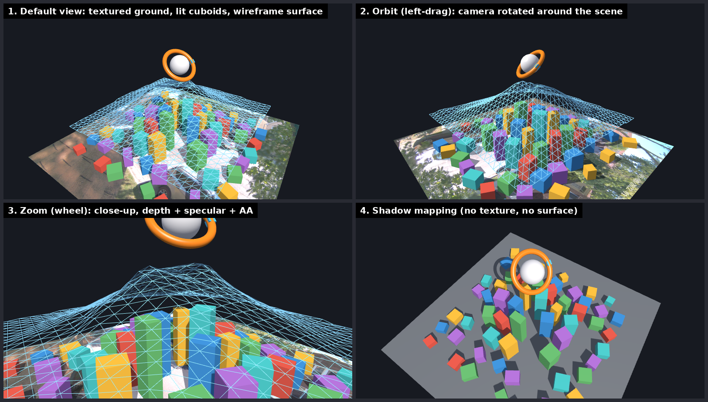
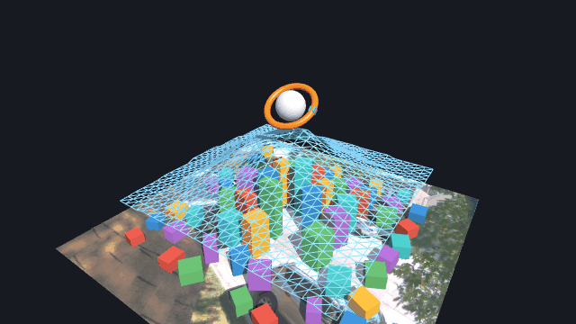
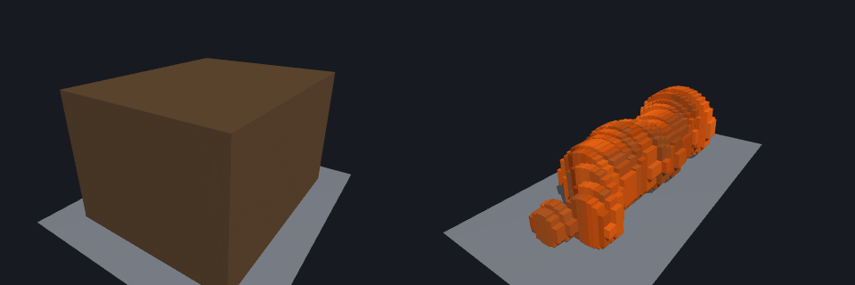

# 3dseg

Experimental Python code for 3D scene understanding from monocular images and
video: ground-plane calibration, superpixel/graph-based segmentation, surface
normals, bird's-eye-view (inverse perspective mapping) reconstruction, and
fitting/rendering of 3D boxes.

> Research code: scripts are standalone experiments, several are near-duplicate
> variants (`*_bk`, `*_cop`, `*_v2`, `*_extrem`), and some have hard-coded paths.

## Real-time 3D viewer

`viewer3d/` is an OpenGL 3.3 viewer for the cuboids the pipeline lifts out of
images. It has a perspective camera with orbit, pan and zoom controls,
Blinn-Phong lighting with shadow maps, a textured ground plane and MSAA. See
**[RUN.md](RUN.md)** for setup, controls and how to export pipeline output to it.

```bash
pip install -r requirements.txt
python -m viewer3d                      # window
python -m viewer3d --headless --out frame.png
```






## 2D photo → 3D cuboids

`lift3d.py` lifts an object photo (taken against `reference.JPG`) into metric 3D
cuboids. It uses a camera calibrated from the scene's vanishing points, a box
model for boxes and round cross-sections for rounded objects. The result is
checked in 3D, not just in projection: against the traced box edges, and
against synthetic shapes with known geometry. See NOTES.md §6.


Step by step (`docs/make_demo.py` regenerates these):




## Requirements

Python 3 with the packages in `requirements.txt`:

```bash
pip install -r requirements.txt
```

`opengl_drawer.py` draws with matplotlib (despite its name). The OpenGL
rendering is in `viewer3d/`.

## Layout

| Path | Purpose |
|------|---------|
| `main.py` | Video demo: pick ROI, build perspective matrix, background subtraction, draw cubes (`output_with_cubes.mp4`) |
| `Calib_GrndPlane.py` | Ground-plane calibration |
| `lifting.py`, `segment_3d.py` | Lifting 2D segments to 3D |
| `segment*.py`, `graph.py`, `seg.py` | Superpixel / graph-based segmentation (plain, BEV, DFS, RAFT variants) |
| `img_rec*.py`, `img_iter*.py` | Image reconstruction / iterative IPM experiments |
| `normals.py`, `ransac.py`, `shape.py` | Surface normals, RANSAC plane fitting, shape helpers |
| `cube.py`, `render.py`, `opengl_drawer.py` | Cube fitting; matplotlib 3D plots; export to the viewer |
| `viewer3d/` | Real-time OpenGL viewer (math, scene graph, geometry, renderer, app) |
| `tests/` | pytest suite for the viewer (math, geometry, offscreen rendering) |
| `surf.py`, `surf/` | Surface reconstruction experiments (with its own copies of `cube.py`, `lifting.py`, `main2.py`) |
| `*.png`, `*.JPG`, `*.bmp` | Sample/reference images and result figures |

## Usage

Most scripts are run directly, e.g.:

```bash
python main.py
```

`main.py` reads a video from a hard-coded path
(`/home/dzhura/ComputerVision/data/bike.mp4`); edit `input_video_path` to point
at your own file. Other scripts likewise expect local image/video paths to be
set near the top of the file.
