# Methods and demonstration images

An overview of every method in this repository, each with its demo images. The
numbers are from the scripts named in each section. NOTES.md has the full
derivations and logs.

## 1. Real-time 3D viewer (`viewer3d/`)

An OpenGL 3.3 viewer (moderngl + glfw) for the reconstructed cuboids and meshes:
- Blinn-Phong lighting with shadow maps, MSAA and per-vertex colours;
- an orbit camera, plus a camera adapter that takes OpenCV `K, R, C`, so a
  model can be drawn over the photo it came from;
- headless rendering (EGL), used to make every image below.

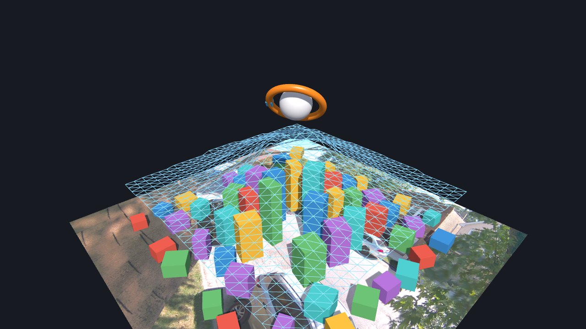

## 2. One photo → metric 3D (`lift3d.py`)

1. **Camera from the scene.** The three vanishing points of the table/room lines
   give the principal point (orthocentre of the VP triangle) and the focal length
   (VP orthogonality). The camera height sets the metric scale.
2. **Object mask.** Difference against `reference.JPG` (same view, no object).
3. **Whole-object model.**
   - **Box objects:** an axis-aligned box tangent to the silhouette along the
     vanishing directions, refined so its visible edges lie on image edges.
   - **Rounded objects:** a stack of round cross-sections (incircles of the
     silhouette slices) on the ground plane.
4. **Verified in 3D, not only in projection:**
   - against the traced 3D box: volume IoU 0.89;
   - against synthetic shapes rendered with known geometry: box 0.93,
     cylinder 0.85, pig 0.66.

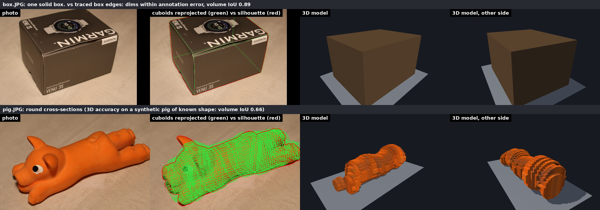
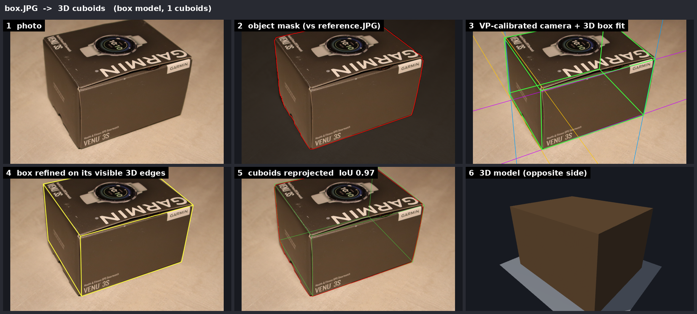
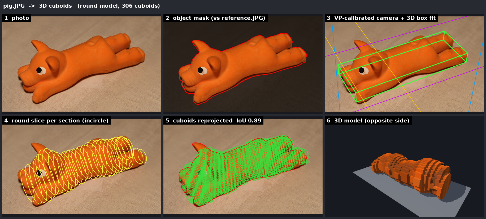
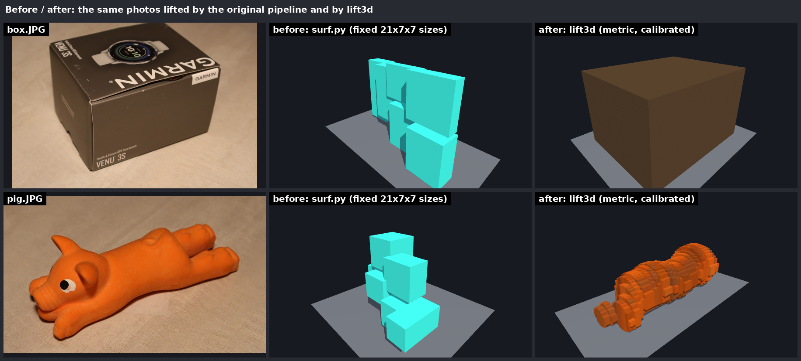

## 3. Video → 3D for rigid objects (`video3d.py`, bike.mp4)

1. **Camera** from the vanishing point of the painted parking lines and the known
   stall width (2.74 m).
2. **Object masks** by median-background subtraction, with the ground shadow removed.
3. **Ground poses** `(x, y, yaw, lean)` per frame:
   - initialised from the silhouette's ground contact;
   - lean from the turn radius (`tan(lean) = v²/(g r)`).
4. **Silhouette carving** in the object's own frame, then alternating with pose
   refinement (silhouette IoU and chamfer), then consensus carving.
5. **Evaluation on held-out frames** never used for carving. Silhouette IoU rises
   from 0.41 (1 frame) to 0.77 (8 frames) to 0.81 (589 frames). The model
   measures 2.02 × 0.73 × 1.48 m.

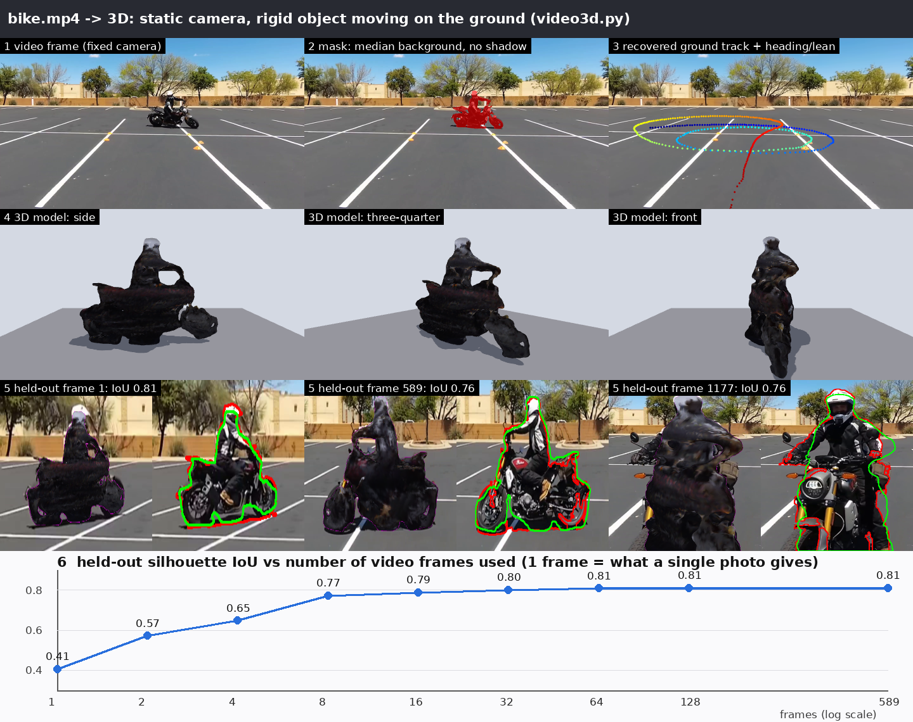
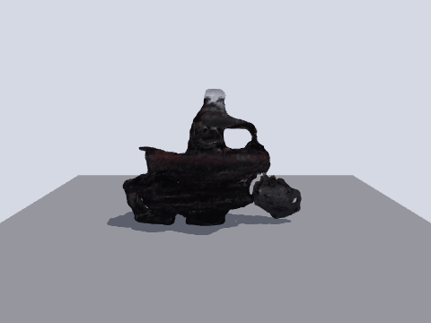

## 4. Video → 3D for non-rigid subjects (`video_demos.py`: horse, person, others)

Carving fails when the shape changes between frames. Instead:
1. Take the best side silhouette.
2. **Inflate** it: half-depth `t·sqrt(D(2R−D))` from the medial-axis radius R and
   the distance D to the outline.
3. **Fit the thickness `t`** on frames where the subject turns, using a
   weak-perspective fit of the upper body. Near-ties go to the roundest shape.

Held-out IoU against a flat cut-out: horse 0.788 vs 0.769, person (Yeop) 0.72 vs 0.69.
Videos with no turning frames (Air, Monument, Bender, Por) keep t = 1.

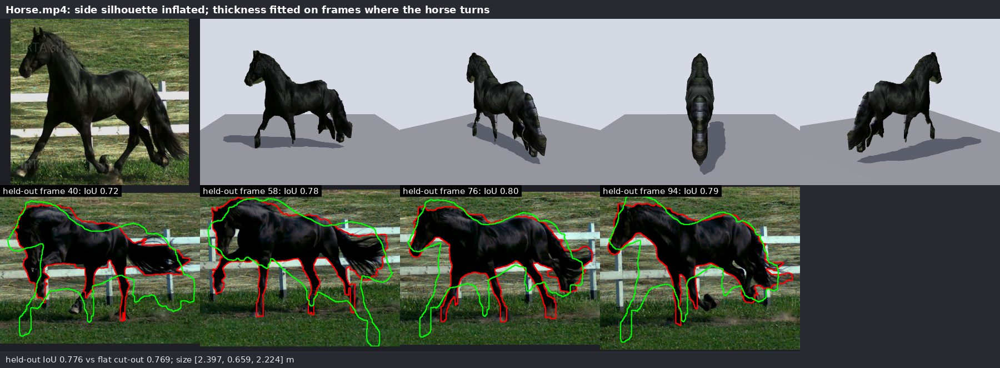
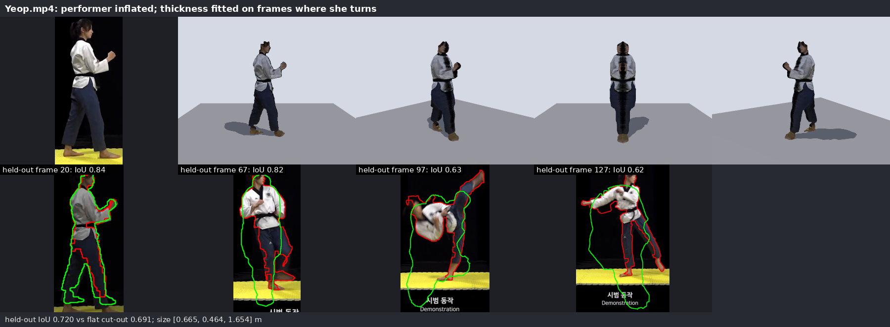
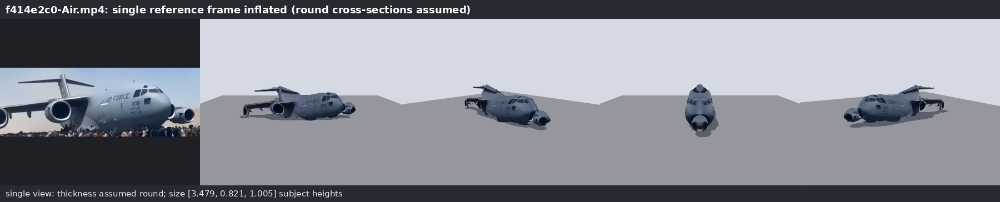
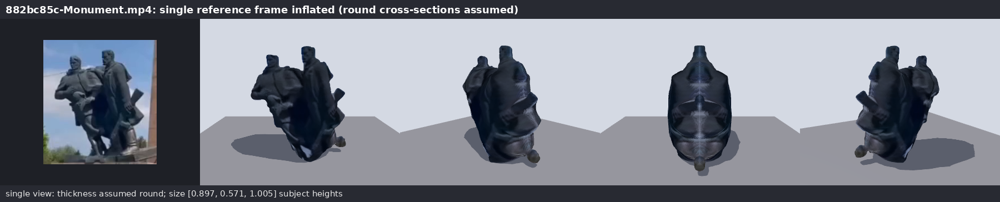
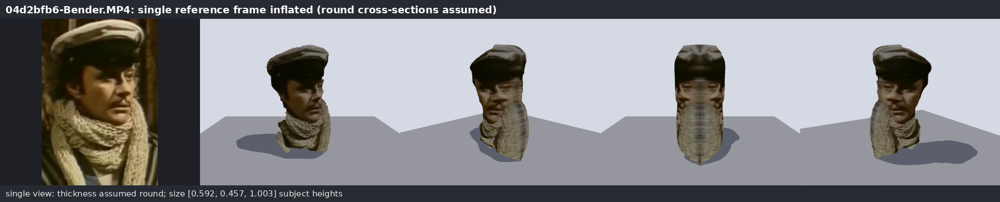
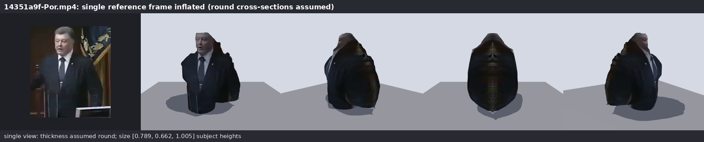

## 5. The original recursive segment-box method (`segment3d.py`)

This keeps the structure of the repository's `surf.py`/`cube.py`:
1. SLIC superpixels inside the object mask.
2. A **vanishing-point tangent box** per superpixel (`cube.compute_3d_box_from_plain_mask_new`).
3. **Seeds:** the superpixels at the object's six extreme points.
4. **Recursive propagation:** each neighbour's box shares a face with an
   already-solved box.

The geometry now uses the calibrated camera, so every box is metric.

**Drift fix (`patch_reconstruct`).** A superpixel is a patch of surface, not a
solid, so its box depth drifts. Each superpixel is instead a planar patch on an
axis-aligned plane:
- seeds go on the faces of the edge-refined main box;
- each neighbour either stays coplanar or folds through the shared edge, chosen
  by colour similarity and vanishing-point edge orientation votes;
- an ICM connectivity refinement then closes 3D gaps.

**Make3D-style baseline (`make3d_planes`).** A global least-squares solve of
one free plane per superpixel, with connectivity and coplanarity terms. The same
seed anchors replace Make3D's learned depth term, because the original model is
not reachable from here.

**Per-pixel depth error against 3D ground truth**

| Method | box.JPG median / ≤3 % | synthetic pig median / ≤3 % |
|---|---|---|
| Recursive boxes (original, calibrated) | 3.6 % / 46 % | 3.0 % / 49 % |
| **Recursive planar patches (drift fix)** | **1.3 % / 84 %** | 4.0 % / 40 % |
| Make3D-style MRF (same anchors) | 1.8 % / 68 % | 5.1 % / 31 % |
| `lift3d` whole-object model | 0.5 % / 100 % | 2.0 % / 68 % |

In the images below, the depth error is coloured from blue (0 %) to red (≥ 8 %).

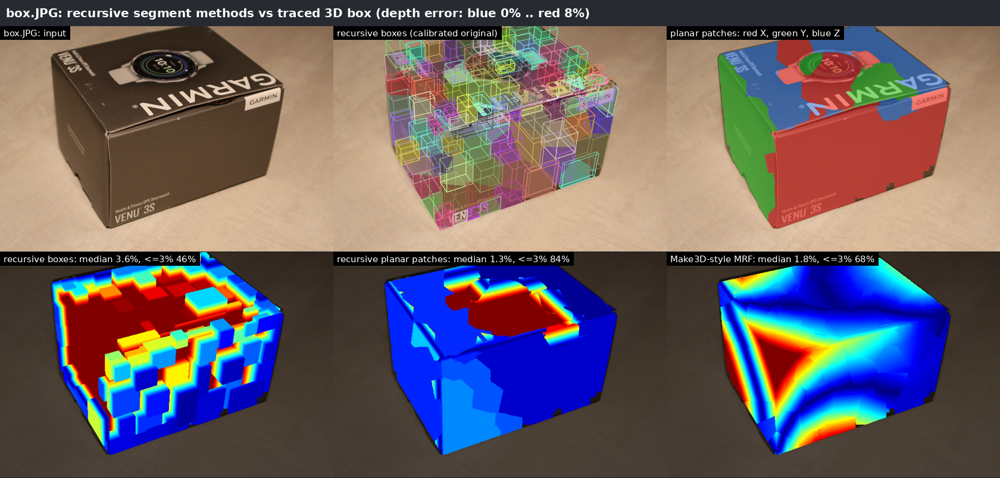
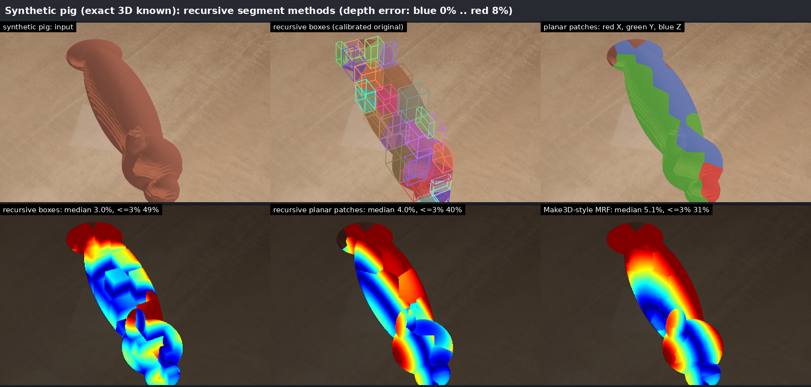

## 6. The recursive box method on video (`video_segments.py`, bike.mp4)

This reuses the computations from section 3: the calibrated camera, each frame's
pose and the carved model's extent.
1. **Object-frame camera.** Each frame's camera is expressed in the motorcycle's
   frame, which gives that frame's three vanishing points of the object axes.
2. **Recursive boxes, unchanged.** `segment3d.reconstruct` runs as is, with the
   main box set to the carved extent. The original 2D tangent-box code expects
   the X vanishing point left of the Y one. For frames where the bike faces the
   other way, the work is done in a frame rotated 90° about the up axis, and the
   boxes are rotated back.
3. **Fusion by voting.** All boxes are already in the object frame. A voxel is
   kept when at least a fraction τ of the frames' boxes cover it, with τ chosen
   on the fusion frames.
4. **Evaluation** on held-out (odd) frames by silhouette IoU, as for the carving.

**Results on 74 held-out frames:**
- 59 of 74 sampled frames give boxes, and 3634 of 3738 segments are solved.
- The remaining frames show the bike almost head-on or from behind. There, one
  vanishing point goes to infinity and the 2D tangent box degenerates.

| Model | held-out silhouette IoU |
|---|---|
| recursive boxes, one frame | 0.513 |
| **recursive boxes, 59 frames fused (τ = 0.3)** | **0.765** |
| silhouette carving (section 3), same masks | 0.848 |

Fusion lifts the original method from 0.51 to 0.77. It still trails carving,
because each frame's boxes overfill the concave parts that the frame cannot see.

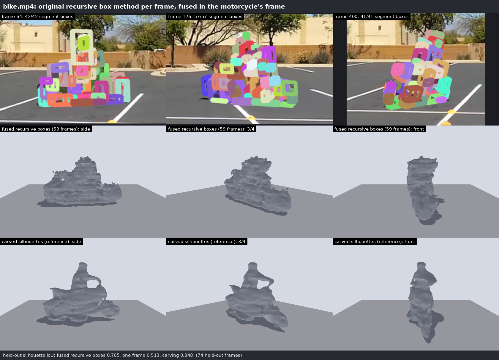

## 7. Improving the recursive cuboids: one global solve (`cuboids_global.py`)

Each segment's 3D box is fixed by its 2D tangent box up to a single scale about the
camera centre. So the recursion's rules are linear equations in one unknown per segment:
- shared-face contact;
- depth continuity across boundaries;
- seed anchors.

The variant solves them all at once with robust bounded least squares, instead of
propagating neighbour by neighbour.

| Variant | box.JPG median | pig median |
|---|---|---|
| Original greedy recursion | **3.6 %** | 3.0 % |
| Global (contact + continuity, robust, bounded) | 4.8 % | 2.4 % |
| Global + whole-object prior | 3.8 % | **2.2 %** |
| Planar patches (section 5) | **1.3 %** | 4.0 % |

- **Curved objects:** the global solve improves them.
- **Flat-faced objects:** it is worse there. Planar patches remain the best model for
  flat faces (NOTES.md section 11).

## 8. Triangulation and 3D normals

**Video (`video_normals.py`).** Feature tracks on bike.mp4 are triangulated in the
motorcycle's frame (median reprojection error 1.34 px). Normals come from local plane
fits. Free space between each camera and the points it saw is then removed from the
carving. On surface points from held-out frames, the median distance drops from
2.7 cm to 2.3 cm (85 % within 5 cm, from 76 %). Poisson reconstruction from these
sparse points alone is worse than carving.

**Single image (`normal_integration.py`).** A normal field fixes the gradient of log
depth, so the shape can be integrated from normals:
- with exact or 10°-noisy normals, each smooth part comes out within 0.5 %;
- normals cannot place separate parts relative to each other (head in front of
  body), so with no extra cue the error is 3.9 %;
- normals from the silhouette alone give 8 %.

Normals therefore need a placement cue: triangulated points or carving in video, the
cuboid seeds and contacts in one image.

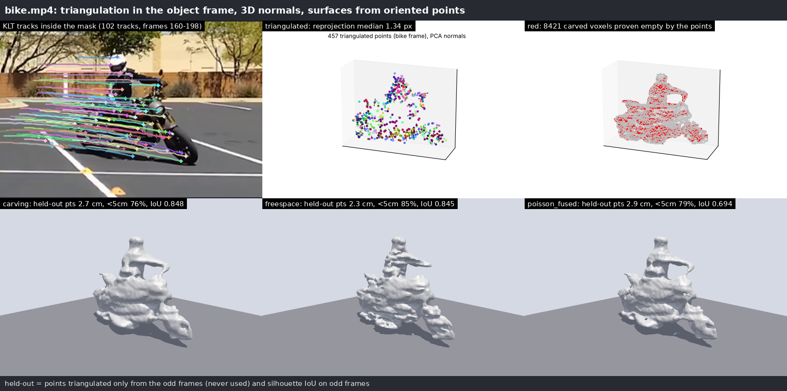
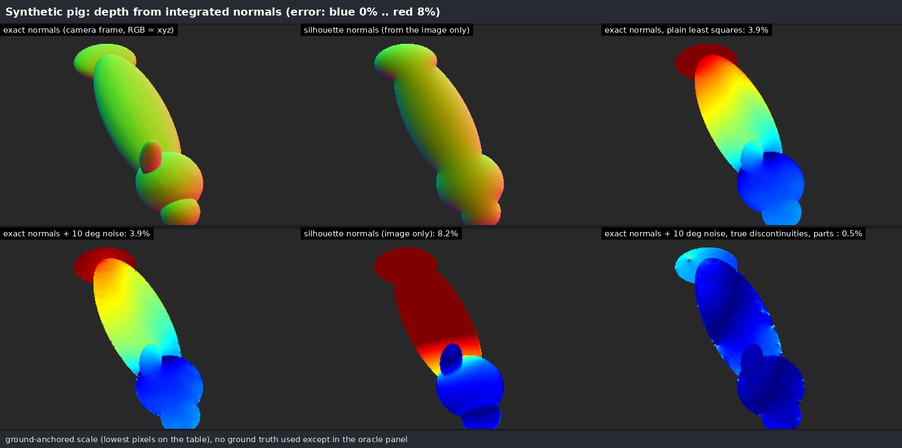
